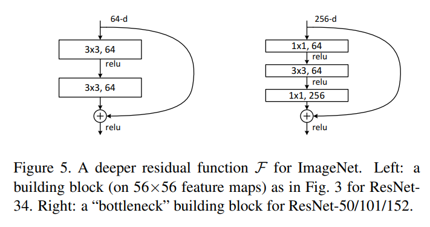
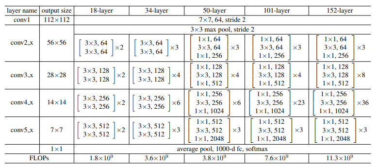
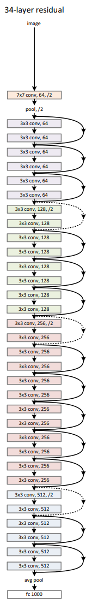
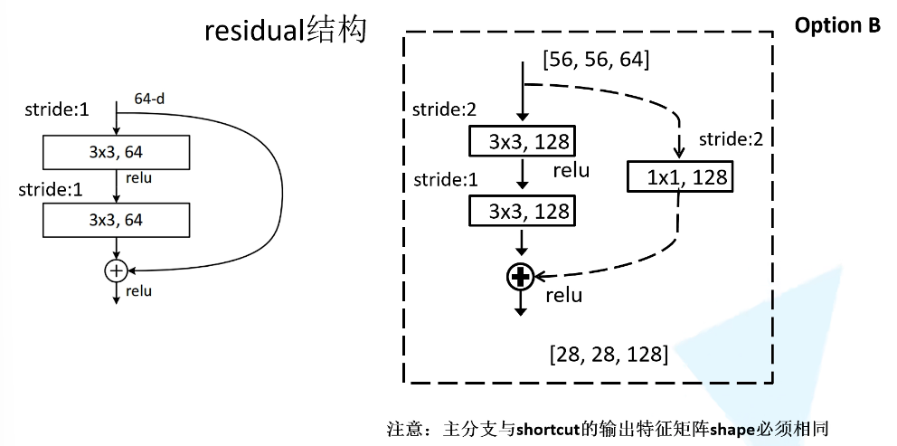
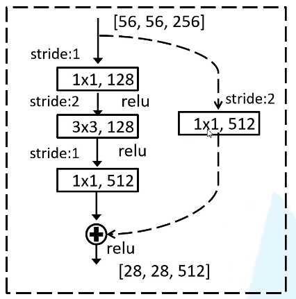

# ResNet详解
## 梯度消失
假设每层的误差梯度小于一，反向传播的过程中每向前传播一次，误差梯度都会变小一点，层数不断加深，最后趋于零，这就是梯度消失的问题。
## 梯度爆炸
如果大于一，层数太多，误差梯度越来越大，最后趋于无限，就会梯度爆炸。
## 退化问题
使用误差值标准化，BN等方法之后，仍然存在的，层数深的时候训练的结果不如层数少的时候的问题
## residual残差模块

左图：输入通道64，卷积核3×3，个数64个，卷积一次后relu，第二次卷积之后与捷径过来的特征矩阵相加，再relu  
右图：1×1卷积层用来升维和降维  
右图是对左图的优化，可以进入更深层

  
虚线部分是因为要改变高，宽和深度，便于relu的相加，改变方式是改变步距

## Batch Normalization标准化处理，加速训练，丢弃dropout
使一批（batch）数据的特征矩阵（feature map）满足均值为0，方差为1  
原因：特征矩阵在经过一次卷积操作之后可能不满足原来需要的特征，这时候就要用BN层使同一批、每一层的特征矩阵满足统一的分布规律  
# 迁移学习
使用别人的预训练模型的参数（通用的低维特征），就算数据集不大也可以训练出效果
